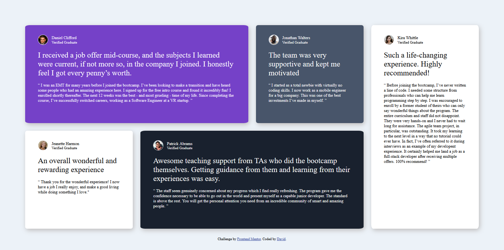

# Frontend Mentor - Testimonials grid section solution

This is a solution to the [Testimonials grid section challenge on Frontend Mentor](https://www.frontendmentor.io/challenges/testimonials-grid-section-Nnw6J7Un7). Frontend Mentor challenges help you improve your coding skills by building realistic projects. 

## Table of contents

- [Overview](#overview)
  - [The challenge](#the-challenge)
  - [Screenshot](#screenshot)
  - [Links](#links)
- [My process](#my-process)
  - [Built with](#built-with)
  - [What I learned](#what-i-learned)
  - [Continued development](#continued-development)
  - [Useful resources](#useful-resources)
- [Author](#author)
- [Acknowledgments](#acknowledgments)

**Note: Delete this note and update the table of contents based on what sections you keep.**

## Overview

### The challenge

Users should be able to:

- View the optimal layout for the site depending on their device's screen size

### Screenshot

### Links

- Solution URL: [Add solution URL here](https://your-solution-url.com)
- Live Site URL: [Add live site URL here](https://your-live-site-url.com)

## My process

  I did a mobile first workflow making all the boxes of the same size then wrote a media query for larger acreen sizes and applied css grid for the layout.

### Built with

- Semantic HTML5 markup
- CSS custom properties
- CSS Grid
- Mobile-first workflow
- media queries

### What I learned

I used this project to challenge my knowledge of css grid and responsive design. I learnt the power of css grid to quickly createa structured layout writing as little css code as possible. I also learnt how to optimize a website for different screen sizes (it's a bit of stress).

### Continued development

I want to focus more on creating structured responsive layouts as well as writing more optimized rather than redundant code.

### Useful resources

- [css grid youtube video](https://youtu.be/_lEkD8IGkwo?si=1OGvdsvVJ6F7Ic6t) - This helped me to understand css grid and hoe to use it in this situation. I really liked this pattern and will use it going forward.

## Author

- Frontend Mentor - [@yourusername](https://www.frontendmentor.io/profile/Dave-n-tech)
- Twitter - [@yourusername](https://www.twitter.com/Dave_n_art_)

## Acknowledgments

I learnt a lot from the youtuber Kevin Powell, his approach helped me understand grid use cases.

